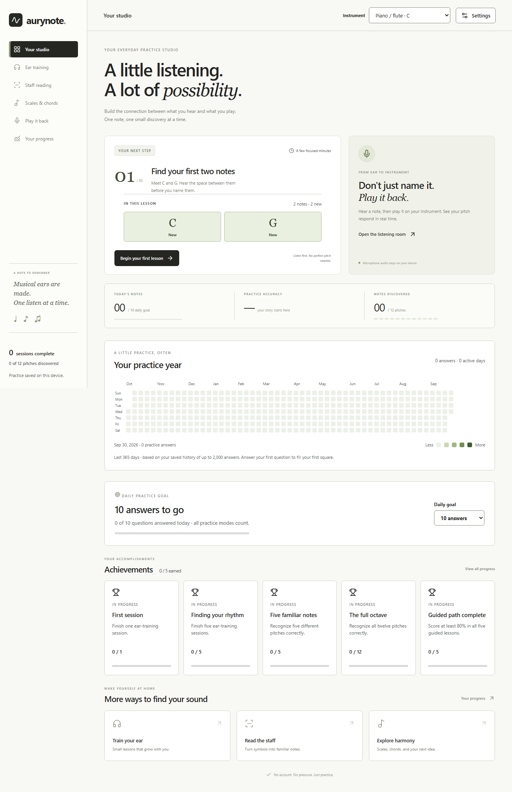
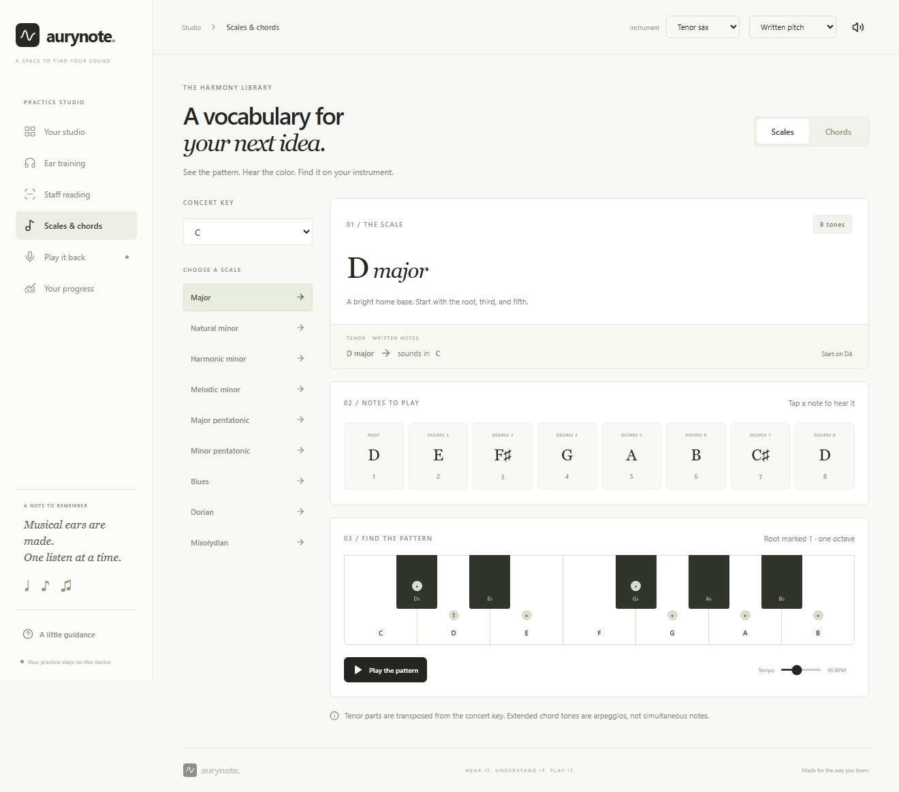

# aurynote demo

aurynote helps beginning musicians connect what they hear, what they read, and what they play in a quiet desktop practice studio.

## A 90-second walkthrough

1. Choose C in Instrument key. Start the first ear lesson, listen to C and G, then take the quiz.
2. Answer incorrectly. Show the answer comparison and longer review period. Pause for more time.
3. Open Read music and identify a treble or bass clef note.
4. Choose the B♭ tenor sax preset; Settings offers Written pitch. Open Scales & chords with concert C selected: the playable scale is D major, including F-sharp and C-sharp. Play it, then explore a chord symbol.
5. Open Play a note, allow the microphone, and hold the displayed note. The indicator responds locally and confirms a steady match.
6. Open Your progress to show saved practice and notes needing attention.

## Built with

Electron, React, TypeScript, Vite, Web Audio, and Lucide icons. Vitest checks theory, persistence, and pitch detection. Playwright checks practice flows, simulated microphone input, and the production Electron window.

There is no backend or account. Microphone audio is analyzed locally and is not recorded or uploaded. Practice history stays on the device and can be exported.

## Limits

- All sounds are synthesized voices, not instrument recordings.
- Microphone practice detects one steady note at a time. Headphones and a quiet room help. Automated matching uses generated audio; real instruments and microphones need field testing.
- Lessons use references and repetition; the app does not promise absolute pitch.
- The Windows portable build is unsigned. Other operating systems have not been packaged or tested.

## Project history and submission

This repository began as a Java Swing prototype on `main`. The `hackathon-overhaul` branch adds a new Electron/TypeScript implementation and retains the Java source for reference. The idea predates the overhaul; describe that history honestly when submitting.

[Next Byte Hacks V4](https://next-byte-hacks-v4.devpost.com/) lists September 30, 2026 at 11:45 PM EDT on its overview. Its [rules](https://next-byte-hacks-v4.devpost.com/rules) require projects to start from scratch during the event. Confirm with the organizers whether a new implementation of an existing idea qualifies. No submission has been made.

If eligible, submit the public branch link, description, technology list, and recorded demo.

